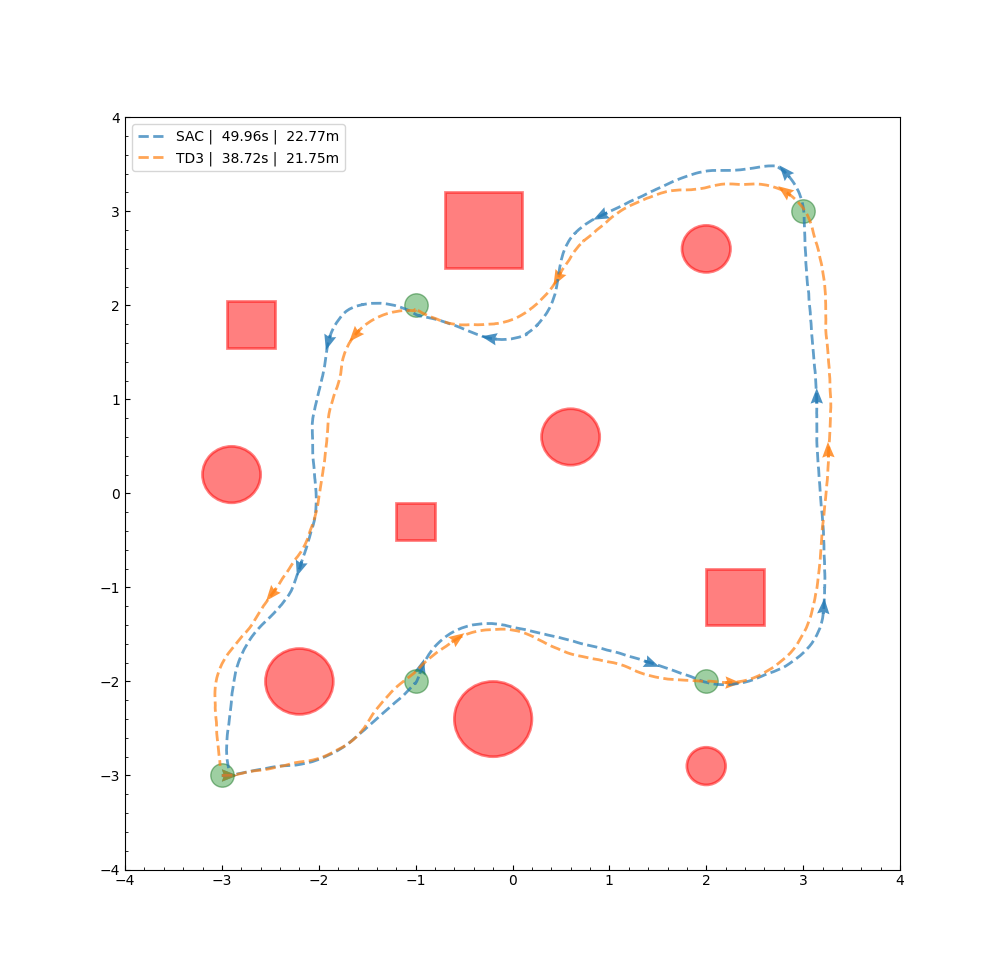
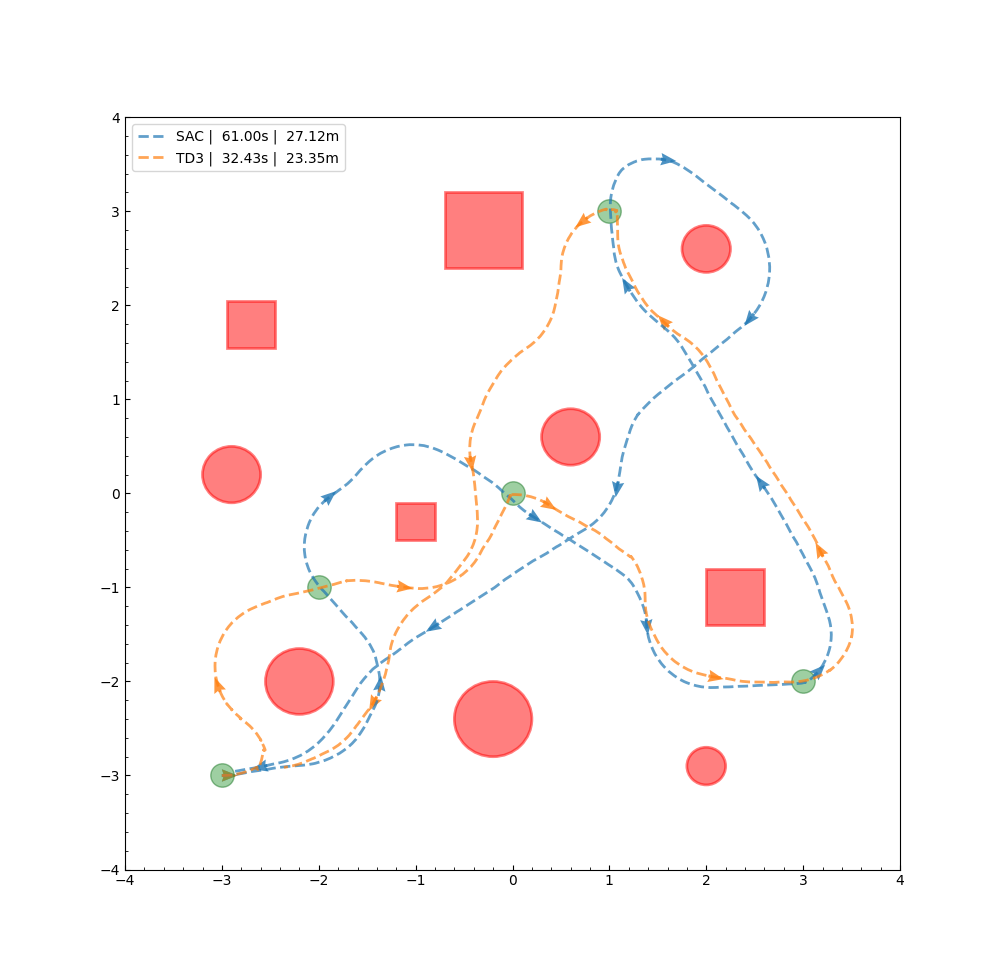

# ROS2_DRL_Navigation
Implementation and comparison of different DRL methods in mapless navigation and obstacle avoidance.

## Demo
The trained DRL policies show smooth navigation and obstacle avoidance while the robot navigates toward the pre-defined waypoints in the environment
 

Preliminary performance comparison of the trained SAC and TD3 policies when applied in two different paths
<table border="0">
  <tr>
   <td><b>Path 1</b></td>
   <td><b>Path 2</b></td>
  </tr>
  <tr>
   <td></td>
   <td></td>
  </tr>
</table>

## Project Structure
Current project structure
```txt
├── 📂 .devcontainer/: handle Dev Container creation in VSCode
│   ├── 📄 devcontainer.json - 
│   └── 📄 Dockerfile - includes the Docker commands for package installation and regular user setup
├── 📂 python/: repository for Python implementation (training and simulation) of DRL algorithms
│   ├── 📂 environments/:
│   │   ├── environment_params.json - contains important MuJoCo simulation parameters, such as
│   │   │                             dimension, visual aspects, and collision properties of
│   │   │                             entities in the scene
│   │   ├── gym_[SAC/TD3].py - DRL policy training scripts for the corresponding algorithms
│   │   ├── gym_[SAC/TD3].ipynb - early experimental training notebooks
│   │   ├── model_creation.py - script to compile a dynamic MuJoCo MjSpec model
│   │   ├── nav2d.py - the gymnasium-compliant MuJoCo environment creation script 
│   │   ├── test_[SAC/TD3].py - individual testing script for the trained policies
│   │   ├── utils.py - contains the shared functions/methods, such as a tensorboard parser to visualize
│   │   │              mean/min/max DRL training performance
│   │   └── x3_robot.stl - mesh file of the robot for visualization purposes in the MuJoCo environment
│   └── 📄 algorithms.py
├── 📂 ros2_ws/src/: contains the ROS2 packages for DRL integration
│   ├── 📂 agent_bringup/: contains the URDF, world, and various launch files to launch components of
│   │                       the ROS2 system
│   ├── 📂 covariance_filter/: contains a node to publish covariance matrices of the Gazebo-simulated
│   │                           IMU and LiDAR for sensor fusion and odometry.
│   ├── 📂 drl_gui/: contains the GUI node that sends a point-to-point or path navigation command
│   ├── 📂 drl_interfaces/: contains the action interfaces for the point-to-point and path navigation actions
│   ├── 📂 drl_policy/: contains the nodes that deploy the DRL policy for point-to-point and queuing waypoints
│   │                    for path navigation. This folder also stores some pre-defined paths for visualization
│   └── 📂 rf20_laser_odometry/: contains the RF2O laser scan matcher for LiDAR odometry
```

## Requirements
